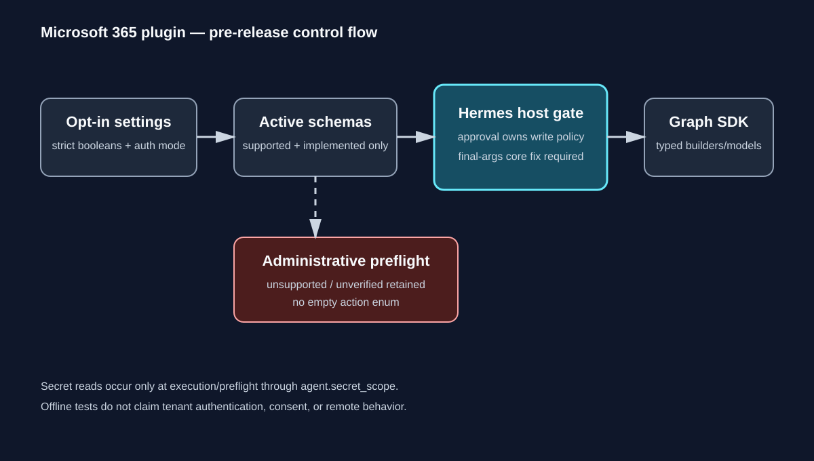

# Hermes Microsoft 365 Plugin

> **Pre-release:** this repository is an offline-verified standalone foundation. It is not a production release and has not been tested against a Microsoft 365 tenant.

One opt-in native Hermes plugin for Outlook, SharePoint, OneDrive, Calendar, Teams Graph, Microsoft To Do, and Planner. It preserves the complete requested operation catalog while exposing only operations that are both compatible with the selected authentication mode and implemented by the current milestone.



## Install for development

```bash
python -m pip install -e '.[test]'
hermes plugins validate microsoft365
hermes plugins doctor microsoft365 --ci
```

A directory install is also supported: install this repository with `hermes plugins install <repo> --no-enable`, then explicitly enable `microsoft365`. `kind: standalone` keeps the plugin opt-in; installing it does not enable it.

## Configuration

Non-secret settings live under the plugin's settings namespace:

```yaml
tenant_id: "00000000-0000-0000-0000-000000000000"
client_id: "11111111-1111-1111-1111-111111111111"
user_id: "22222222-2222-2222-2222-222222222222"
authentication_mode: application
capabilities:
  outlook:
    search: true
  teams:
    send_messages: false
```

`MICROSOFT365_CLIENT_SECRET` is declared as a structured `requires_env` secret. It is resolved only at execution or local preflight through `agent.secret_scope`; it is not an ordinary config field and is never captured during registration.

Capability values must be actual YAML booleans. Strings (`"false"`), numbers, unknown services, and unknown operations are configuration errors. A service with no executable selected actions is not registered as a model-facing tool, but every selected operation remains visible in `microsoft365_preflight`.

The manifest declares the union of the default and maximum configured registrations: `microsoft365_preflight` plus the seven service tool names. Runtime registration remains conditional, so disabled services do not receive model-facing schemas. This keeps catalog metadata truthful without exposing disabled operations.

## Product contract

The administrative registry retains all operations:

- Outlook: `search`, `read`, `create_draft`, `send`
- SharePoint: `search`, `read`, `download_files`, `upload_files`
- OneDrive: `search`, `read`, `download_files`, `upload_files`
- Calendar: `search`, `create_events`, `update_events`
- Teams Graph: `list_teams`, `list_channels`, `search_messages`, `send_messages`
- Microsoft To Do: `list_task_lists`, `search`, `read`, `create_tasks`, `update_tasks`
- Planner: `list_plans`, `list_buckets`, `list_tasks`, `read`, `create_tasks`, `update_tasks`

The registry records authentication support, implementation state, permissions, and write approval requirements per operation. Unsupported or not-yet-verified combinations are reported rather than deleted or silently promoted into active schemas.

## Verification boundary

The test suite is offline. It uses `msgraph-sdk==1.62.0` generated request builders, generated models, Kiota `RequestInformation`, and a strict transport-boundary adapter. It verifies typed request configurations for representative Outlook, Calendar, To Do, drive, Teams, and Planner collections; real collection response normalization; complete binary base64 preservation; strict capability parsing; schema registration; and scoped secret access.

This does **not** verify tenant authentication, consent, endpoint permissions, throttling, pagination against Graph, or mutation behavior in a remote tenant.

## Known limitations

See [Known limitations](docs/known-limitations.md). In particular:

- delegated authentication is not implemented;
- operations without strict executable contracts stay in preflight as `not_implemented` or `not_verified` and are not model-facing;
- no workaround is included for the Hermes host approval modification-order defect; safe write execution depends on the separate generic core fix;
- no catalog entry or release claim is made by this milestone.

## Version

`pyproject.toml` is the single source of truth for the version. `microsoft365/plugin.yaml` must
declare that **exact same string** — already in PEP 440 canonical form (`0.1.0a1`, never the
equivalent-looking `0.1.0-alpha.1`), so the manifest always matches the metadata of the built wheel.

The Hermes host reads the manifest `version` for display only (`plugins list`, install/update
messages) and imposes no spelling requirement, so no legacy form needs preserving.
`tests/test_manifest.py` enforces the agreement against both `pyproject.toml` and, when the
distribution is installed, `importlib.metadata`.

## Development

See [CONTRIBUTING.md](CONTRIBUTING.md). Release evidence and the catalog hand-off boundary are documented in [docs/release.md](docs/release.md). Security issues should follow [SECURITY.md](SECURITY.md).

## License

MIT
